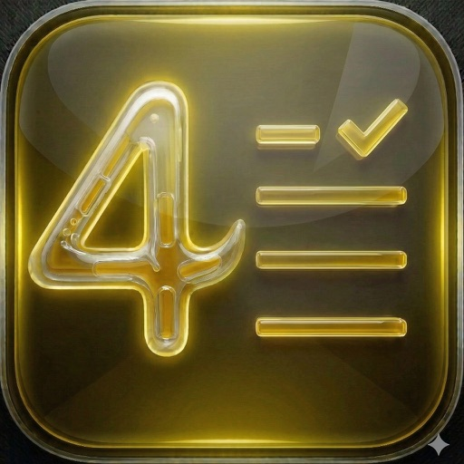
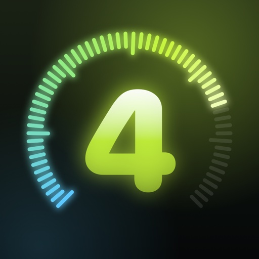

# robspace Apps — Community Hub

**The home for bug reports, feature requests, and discussions around the robspace iOS apps.**

[robspace.de](https://robspace.de) · [Report a bug](https://github.com/RobEarth0815/robspace-apps/issues/new/choose) · [Start a discussion](https://github.com/RobEarth0815/robspace-apps/discussions) · [Email support](mailto:support@robspace.de)

---

## Welcome

Hi — and thanks for stopping by. This repository is **not where the apps live**; it's where their *community* lives. If you use a robspace app and want to report a bug, suggest a feature, ask a question, or just share how you use it, you're in the right place.

The apps themselves are written in SwiftUI and shipped through the App Store. Their source isn't public, but everything *around* them — the conversation about how they work, what's missing, and what comes next — is open to anyone. That's what this repo is for.

> **The robspace philosophy:** *Less features means more value.* Small, focused, privacy-first tools that do one thing and stay out of your way. Feedback from real users is the biggest lever I have to keep them that way — so thank you for taking the time.

---

## The apps

<table>
<tr>
<td width="100" align="center">

</td>
<td>
<h3>4RSS — Your Feeds, Your Way</h3>
A minimalist RSS reader for iPhone. Four feed slots, no algorithms, no accounts, no tracking. Just the content you chose, the way you chose it. 
<a href="docs/apps/4rss.md">Details</a> · <a href="https://4rss.app.robspace.de">Website</a> · <a href="https://apps.apple.com/app/4rss/id6756433329">App Store</a> · <a href="https://github.com/RobEarth0815/robspace-apps/issues/new?labels=app%3A4rss%2Ctype%3Abug&template=bug_report.yml">Report a 4RSS bug</a>
</td>
</tr>
<tr>
<td width="100" align="center">

</td>
<td>
<h3>4Meds — Simple Medication Tracker</h3>
Track medications, supplements, and the occasional painkiller. Reminders, history, and a clear picture of your daily routine — offline and private by default. 
<a href="docs/apps/4meds.md">Details</a> · <a href="https://4meds.app.robspace.de">Website</a> · <a href="https://apps.apple.com/app/4meds/id6760107781">App Store</a> · <a href="https://github.com/RobEarth0815/robspace-apps/issues/new?labels=app%3A4meds%2Ctype%3Abug&template=bug_report.yml">Report a 4Meds bug</a>
</td>
</tr>
<tr>
<td width="100" align="center">

</td>
<td>
<h3>4Budget — The Most Simple Budget Tracker</h3>
Set a budget, log expenses, see what's left. Local data, no subscriptions, no cloud accounts. A budgeting app that respects your time and your privacy. 
<a href="docs/apps/4budget.md">Details</a> · <a href="https://4budget.app.robspace.de">Website</a> · <a href="https://apps.apple.com/app/4budget/id6759730753">App Store</a> · <a href="https://github.com/RobEarth0815/robspace-apps/issues/new?labels=app%3A4budget%2Ctype%3Abug&template=bug_report.yml">Report a 4Budget bug</a>
</td>
</tr>
<tr>
<td width="100" align="center">

</td>
<td>
<h3>4DI — Data Integrity Helping Tool</h3>
A pocket reference for pharmaceutical and life-science professionals. ALCOA++, regulatory frameworks, GEMBA walks, inspection findings, glossary. Built by someone who works in the field. 
<a href="docs/apps/4di.md">Details</a> · <a href="https://4di.app.robspace.de">Website</a> · <a href="https://apps.apple.com/app/4di-data-integrity-tool/id6760180866">App Store</a> · <a href="https://github.com/RobEarth0815/robspace-apps/issues/new?labels=app%3A4di%2Ctype%3Abug&template=bug_report.yml">Report a 4DI bug</a>
</td>
</tr>
<tr>
<td width="100" align="center">

</td>
<td>
<h3>4Migraine — Smart Migraine Tracker</h3>
Log attacks in real time, capture triggers and weather context, find patterns, and export a PDF report you can hand to your doctor. All data stays on your device. 
<a href="docs/apps/4migraine.md">Details</a> · <a href="https://4migraine.app.robspace.de">Website</a> · <a href="https://apps.apple.com/app/4migraine/id6760842125">App Store</a> · <a href="https://github.com/RobEarth0815/robspace-apps/issues/new?labels=app%3A4migraine%2Ctype%3Abug&template=bug_report.yml">Report a 4Migraine bug</a>
</td>
</tr>
<tr>
<td width="100" align="center">

</td>
<td>
<h3>4ToDo — Simple Task Manager</h3>
Tasks, routines, and goals — not as checklists, but as visual progress bars. See at a glance what you've done and what's left. Clean, minimal, focused. 
<a href="docs/apps/4todo.md">Details</a> · <a href="https://4todo.app.robspace.de">Website</a> · <a href="https://apps.apple.com/app/4todo/id6760901710">App Store</a> · <a href="https://github.com/RobEarth0815/robspace-apps/issues/new?labels=app%3A4todo%2Ctype%3Abug&template=bug_report.yml">Report a 4ToDo bug</a>
</td>
</tr>
<tr>
<td width="100" align="center">

</td>
<td>
<h3>4Level — Stick to Your Resolutions</h3>
For ambitious amateur athletes: one honest fitness level from your Apple Health workouts — and a clear view of whether you stick to your own training resolutions. On-device, no accounts. <i>Version 1.0 is in App Review.</i> 
<a href="docs/apps/4level.md">Details</a> · <a href="https://4level.app.robspace.de">Website</a> · <a href="https://github.com/RobEarth0815/robspace-apps/issues/new?labels=app%3A4level%2Ctype%3Abug&template=bug_report.yml">Report a 4Level bug</a>
</td>
</tr>
</table>

---

## How to participate

There are three ways to engage with this repo, depending on what you want to do:

### 🐞 Report a bug — open an Issue

Something broken? A crash, a wrong number, a button that does nothing? Open an issue using the **Bug Report** template. The template will ask you for the app, your iOS version, your device, and steps to reproduce — please fill those in so the fix lands faster.

**[→ Open a bug report](https://github.com/RobEarth0815/robspace-apps/issues/new?template=bug_report.yml)**

### ✨ Suggest a feature — open an Issue

Have an idea for something a robspace app should do (or stop doing)? Open a **Feature Request**. Don't worry about whether it's "small" or "obvious" — if it would make the app better for you, I want to hear it. Even if I don't end up building it, you'll get a clear answer on why.

**[→ Suggest a feature](https://github.com/RobEarth0815/robspace-apps/issues/new?template=feature_request.yml)**

### 💬 Ask a question or share — start a Discussion

Not sure if it's a bug? Want to ask "how do you use 4Budget for X?" Want to share a workflow that worked for you? Discussions are the place. They're less formal than issues, threaded, and other users can chime in too.

**[→ Open the Discussions board](https://github.com/RobEarth0815/robspace-apps/discussions)**

---

## What happens after you post

I'm a solo developer in Hofheim am Taunus, Germany. I read everything that comes in here, usually within a day or two — sometimes faster, occasionally a bit slower if I'm deep in another release. Here's what to expect:

- **Bug reports** get triaged with a `status:needs-triage` label first, then either move to `status:investigating`, `status:planned`, `status:duplicate`, `status:cant-reproduce`, or `status:wont-fix` with a comment explaining why.
- **Feature requests** are read carefully but answered honestly: not everything makes the cut, because the apps stay simple by design. A "no, because…" is a real answer, not a rejection of you.
- **Discussions** are open-ended. I'll join in where I can add something, but you're free to talk among yourselves.
- **Critical bugs** (data loss, app won't launch, broken core feature) jump the queue and ship as a hotfix as fast as TestFlight + App Review allow.

---

## Issue labels

Issues are labeled by **app** (`app:4rss`, `app:4meds`, …), by **type** (`type:bug`, `type:enhancement`, `type:question`, `type:documentation`), and by **status** (`status:needs-triage`, `status:investigating`, `status:planned`, `status:duplicate`, `status:wont-fix`, `status:cant-reproduce`). You can filter the issue list by any combination of these — e.g. "all open 4Meds bugs being investigated".

---

## Privacy — what to include and what not to

The robspace apps are designed to keep your data **on your device**. The same principle applies here:

- ❌ **Do not paste personal data** into issues or discussions — no health logs, no medication names tied to a real person, no financial figures from your real budget. Use placeholders.
- ✅ Screenshots are great, but **redact anything personal first** (the apps have export/share features that can produce sanitized examples).
- ✅ Crash logs, screen recordings, system info (iOS version, device model) — all welcome.

Issues and discussions on this repo are **public**. Assume anything you post can be read by anyone, indexed by search engines, and quoted forever.

---

## About robspace

The robspace apps are built by **Robert Poetzsch**, a solo developer based in Hofheim am Taunus, Germany. The brand is *robspace*; the developer name on the App Store is *Robert Poetzsch*.

- 🌐 Website: [robspace.de](https://robspace.de)
- 📧 Direct support: [support@robspace.de](mailto:support@robspace.de) — for anything that doesn't belong in public (license issues, data privacy questions, business inquiries)
- 🍎 App Store developer page: [Robert Poetzsch on the App Store](https://apps.apple.com/us/developer/robert-poetzsch/id1860642630)

---

## Code of Conduct

This is a small, friendly community. The rules are simple: **be kind, be specific, be patient.** The full text is in [CODE_OF_CONDUCT.md](CODE_OF_CONDUCT.md).

---

Made with care in Germany 🇩🇪 · Apps stay simple · Data stays yours

