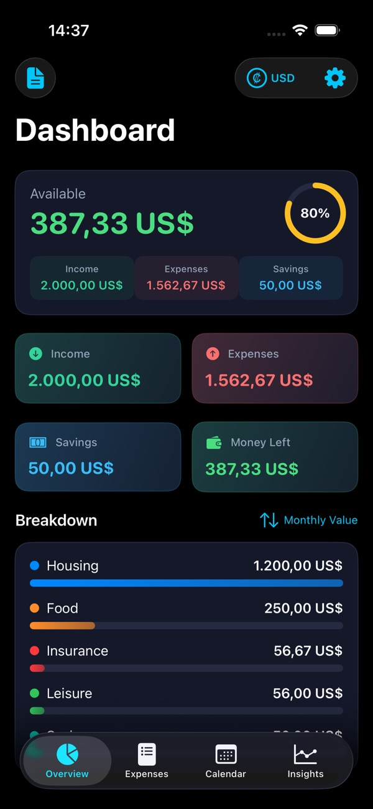
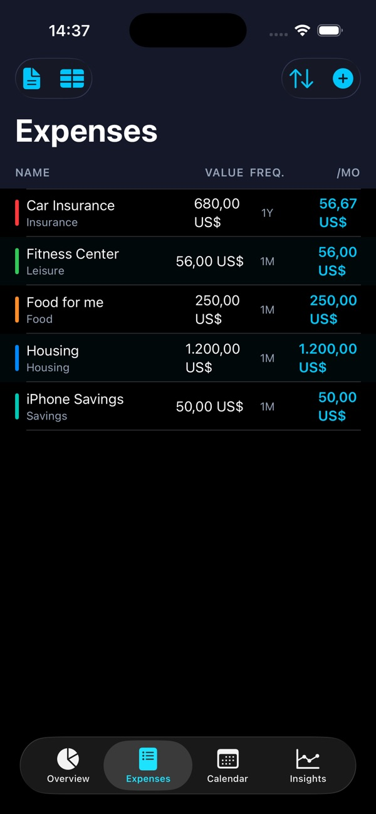
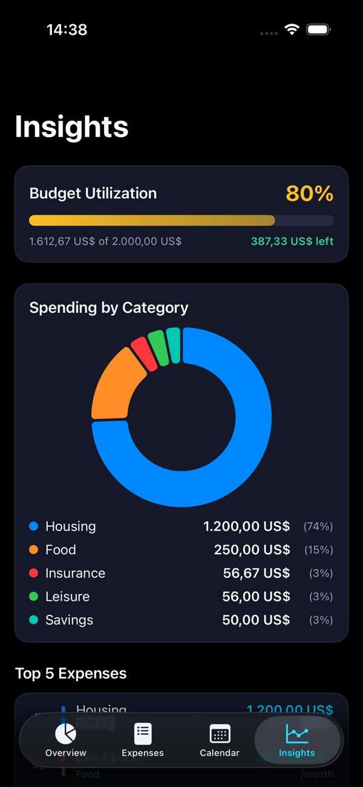
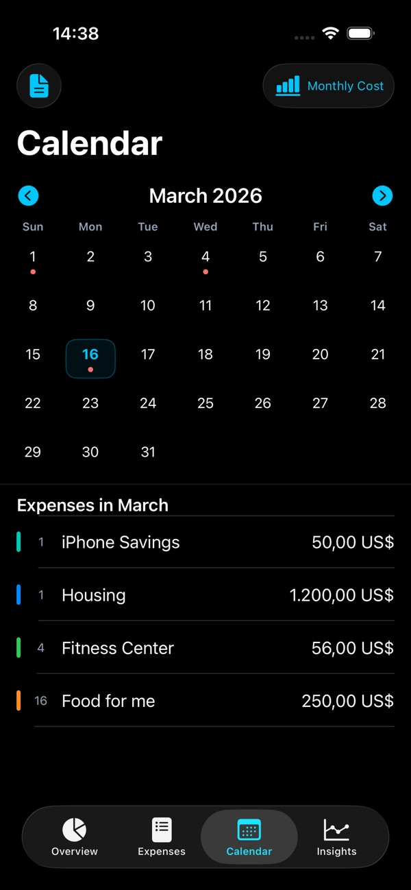
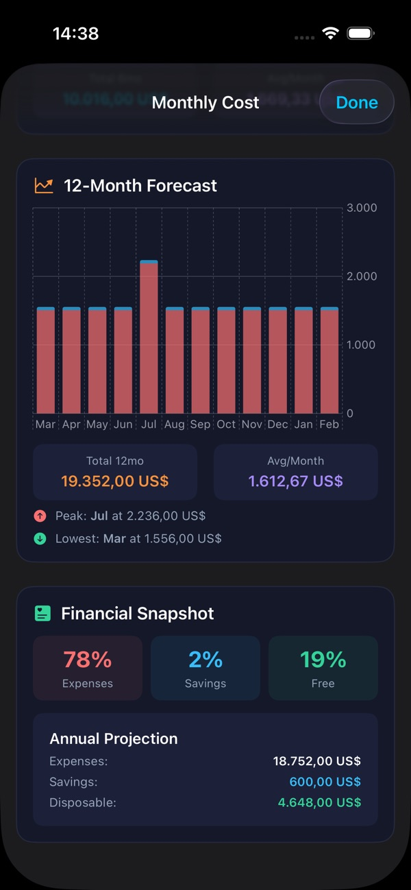
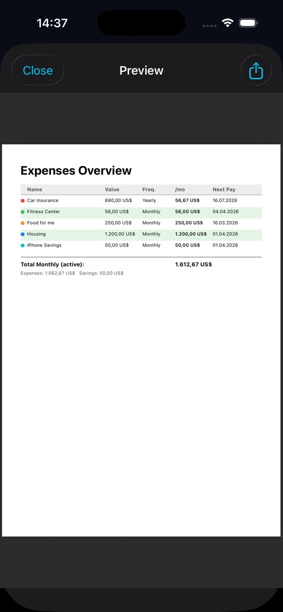
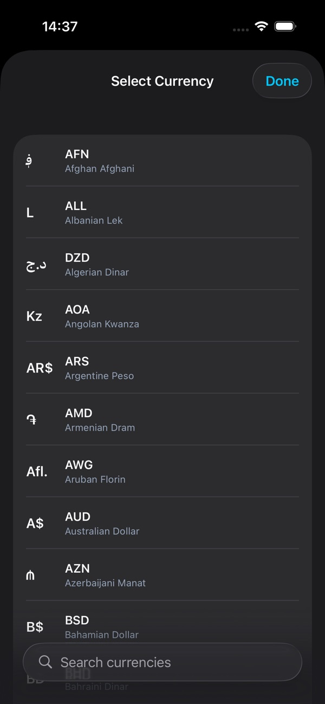
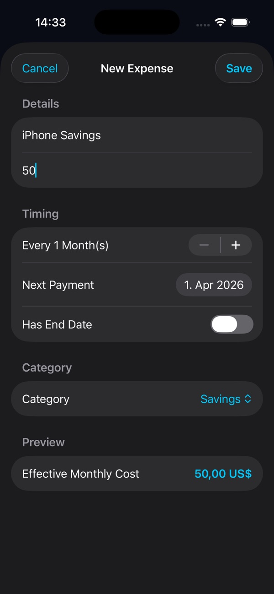

# 4Budget — The Most Simple Budget Tracker

**Track income, recurring expenses, and savings goals — all on your device.**

4Budget is a personal-finance app for people who don't want a personal-finance app. No bank linking, no subscriptions, no ads. Set a budget, log expenses, see what's left — that's the whole feature list.

[**↓ Get it on the App Store**](https://apps.apple.com/app/4budget/id6759730753) · [Website](https://4budget.app.robspace.de)

---

## What it does

- **Dashboard with current balance** — what's the bottom line *right now*.
- **Recurring expenses** — rent, subscriptions, the gym. Set once, deducted automatically.
- **Calendar view** for spotting clusters and dry months.
- **Forecasting** — where will I be at end of month, end of year.
- **PDF + CSV export** — your data is portable.
- **100% local.** No account, no cloud, no subscription. One-time purchase.

## Screenshots

<table>
<tr>
<td></td>
<td></td>
<td></td>
</tr>
<tr>
<td></td>
<td></td>
<td></td>
</tr>
<tr>
<td></td>
<td></td>
<td></td>
</tr>
</table>

Full gallery and latest screenshots on the [App Store page](https://apps.apple.com/app/4budget/id6759730753).

## Specs

| | |
|---|---|
| **Platform** | iPhone |
| **Minimum iOS** | 26.1 |
| **Category** | Finance |
| **Price** | $1.99 (one-time) |
| **Languages** | English |
| **Privacy** | 100% local, no accounts, no tracking |

## File an issue for 4Budget

- 🐞 [Bug report — 4Budget](https://github.com/RobEarth0815/robspace-apps/issues/new?labels=app%3A4budget%2Ctype%3Abug%2Cstatus%3Aneeds-triage&template=bug_report.yml)
- ✨ [Feature request — 4Budget](https://github.com/RobEarth0815/robspace-apps/issues/new?labels=app%3A4budget%2Ctype%3Aenhancement%2Cstatus%3Aneeds-triage&template=feature_request.yml)
- 💬 [Discuss 4Budget](https://github.com/RobEarth0815/robspace-apps/discussions)
- 🔍 [Browse open 4Budget issues](https://github.com/RobEarth0815/robspace-apps/issues?q=is%3Aopen+is%3Aissue+label%3Aapp%3A4budget)

> ⚠️ **Privacy reminder:** Use round-number placeholders in public issues — "expense €100" rather than your actual rent.
