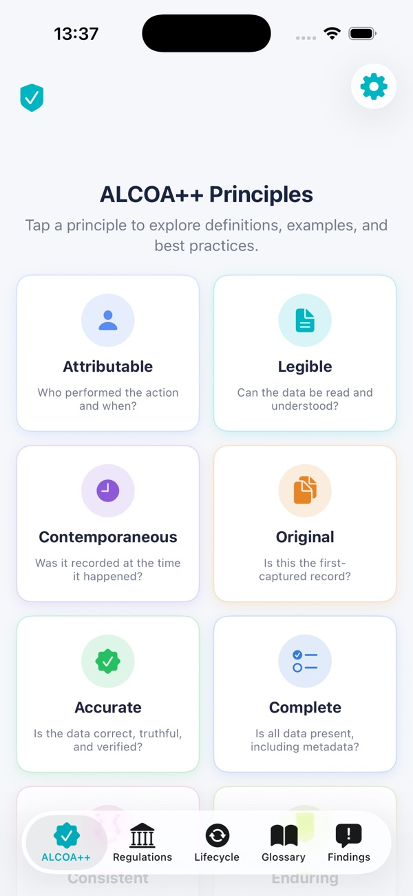
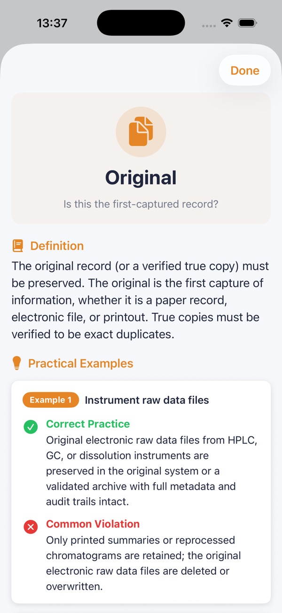
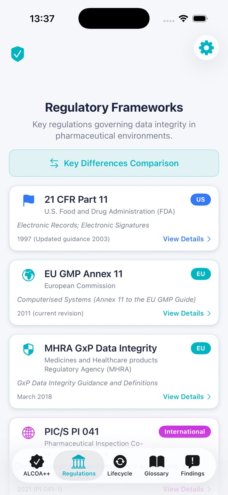
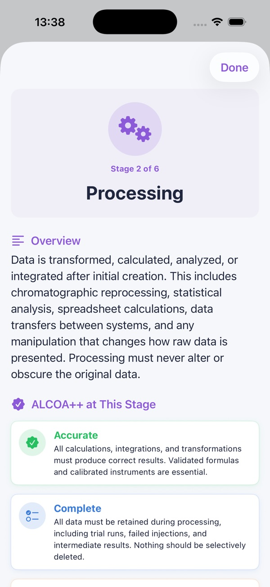
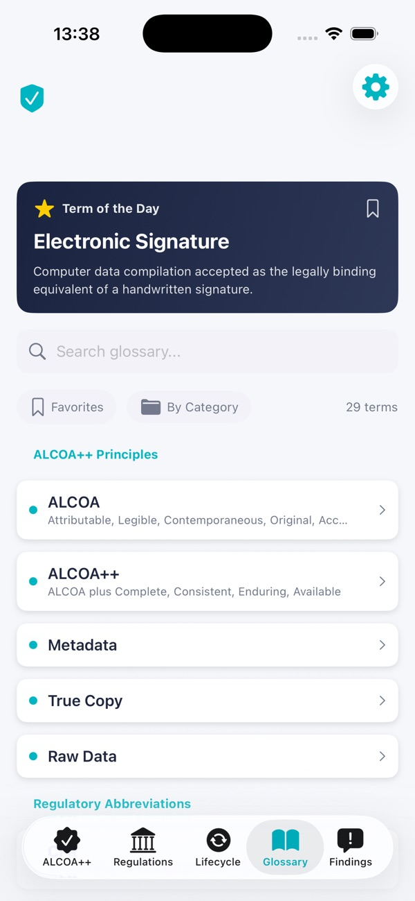
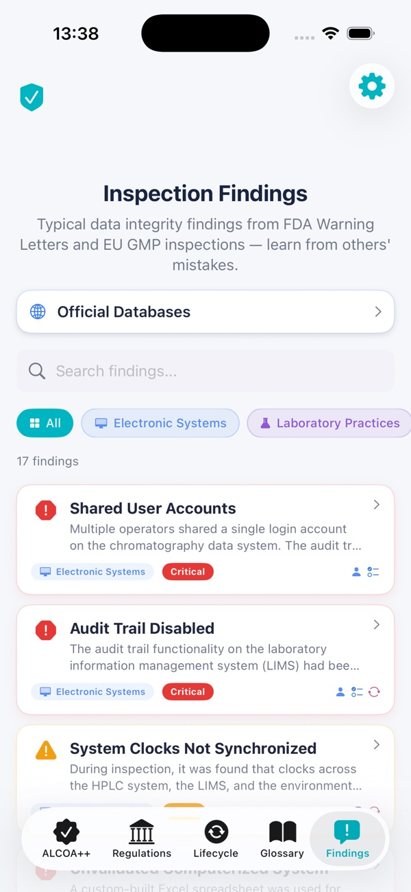
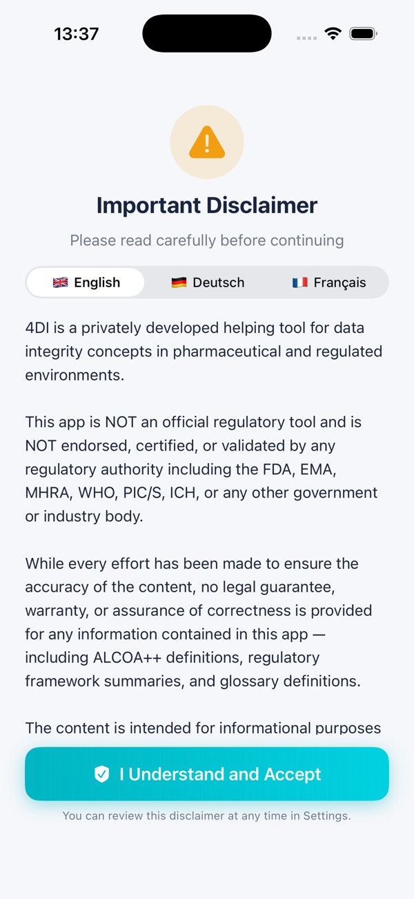

# 4DI — Data Integrity Helping Tool

**Your pocket reference for pharmaceutical data integrity.**

4DI is a professional reference tool for people who work in pharmaceutical and life-science environments where ALCOA++ compliance, GxP, and regulatory inspections are part of daily life. It's not a regulatory document, and it's not endorsed by any agency — it's a *helping tool* built by someone who works in the field.

[**↓ Get it on the App Store**](https://apps.apple.com/app/4di-data-integrity-tool/id6760180866) · [Website](https://4di.app.robspace.de) · [Web app](https://4di.app.robspace.de/webapp/)

---

## What it does

- **ALCOA++ principles** — searchable, with examples and edge cases.
- **Regulatory framework explorer** — FDA, EMA, MHRA, WHO, PIC/S references.
- **GEMBA Walk documentation** templates and prompts.
- **Inspection findings** — real-world examples to learn from.
- **Comprehensive glossary** — every acronym, every term.
- **🇬🇧 English, 🇩🇪 Deutsch, 🇫🇷 Français.**
- **Fully offline.** No data collection. Suitable for sensitive workplace environments.

## Screenshots

<table>
<tr>
<td></td>
<td></td>
<td></td>
</tr>
<tr>
<td></td>
<td></td>
<td></td>
</tr>
<tr>
<td></td>
<td></td>
<td></td>
</tr>
</table>

Full gallery and latest screenshots on the [App Store page](https://apps.apple.com/app/4di-data-integrity-tool/id6760180866).

## Specs

| | |
|---|---|
| **Platform** | iPhone & iPad |
| **Minimum iOS** | 18.6 |
| **Category** | Productivity |
| **Price** | Free |
| **Languages** | English, German, French |
| **Privacy** | Fully offline, no data collection |
| **Companion** | Web app at [4di.app.robspace.de/webapp](https://4di.app.robspace.de/webapp/) |

## A note on scope

4DI is **not a regulatory document** and is **not endorsed by any authority**. It's a learning and reference aid. The definitive sources are always the agency publications themselves — 4DI helps you find them and understand them, but doesn't replace them. Bug reports about content accuracy are very welcome.

## File an issue for 4DI

- 🐞 [Bug report — 4DI](https://github.com/RobEarth0815/robspace-apps/issues/new?labels=app%3A4di%2Ctype%3Abug%2Cstatus%3Aneeds-triage&template=bug_report.yml)
- ✨ [Feature request — 4DI](https://github.com/RobEarth0815/robspace-apps/issues/new?labels=app%3A4di%2Ctype%3Aenhancement%2Cstatus%3Aneeds-triage&template=feature_request.yml)
- 📖 [Content correction — 4DI](https://github.com/RobEarth0815/robspace-apps/issues/new?labels=app%3A4di%2Ctype%3Adocumentation%2Cstatus%3Aneeds-triage&template=documentation.yml)
- 💬 [Discuss 4DI](https://github.com/RobEarth0815/robspace-apps/discussions)
- 🔍 [Browse open 4DI issues](https://github.com/RobEarth0815/robspace-apps/issues?q=is%3Aopen+is%3Aissue+label%3Aapp%3A4di)
