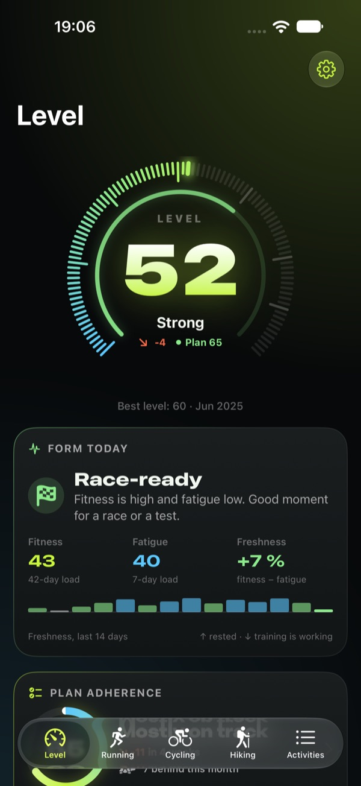
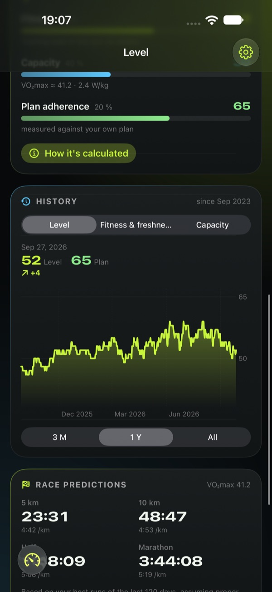
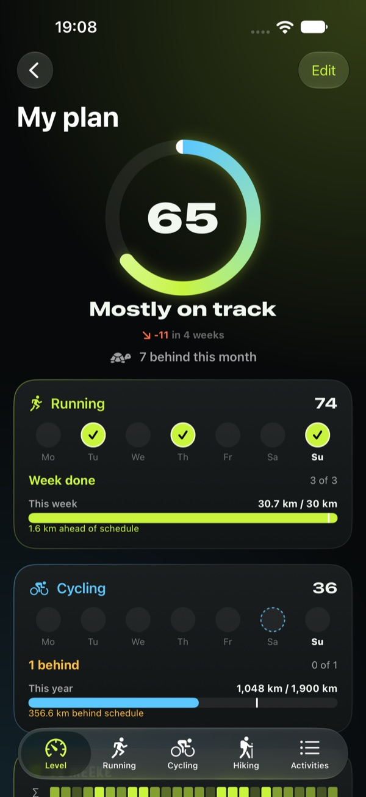
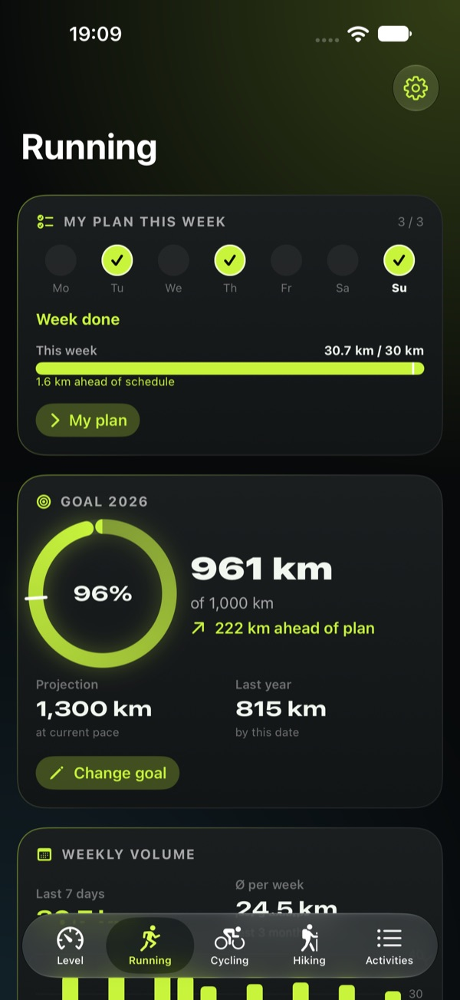
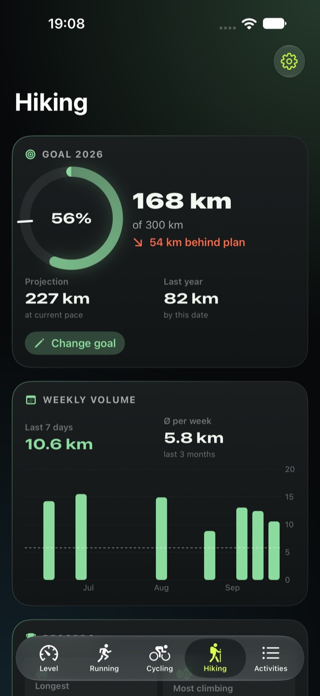
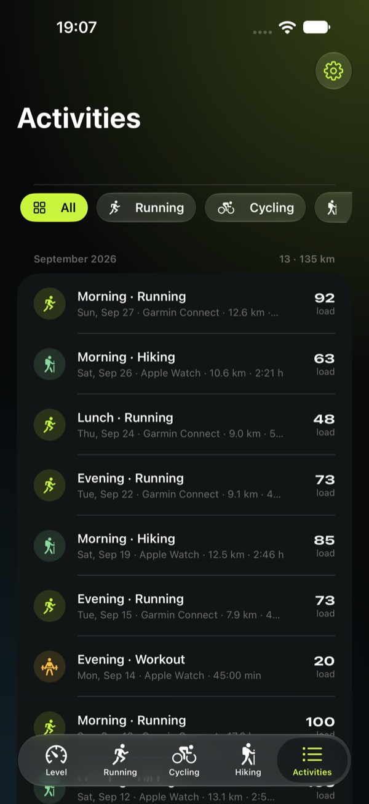
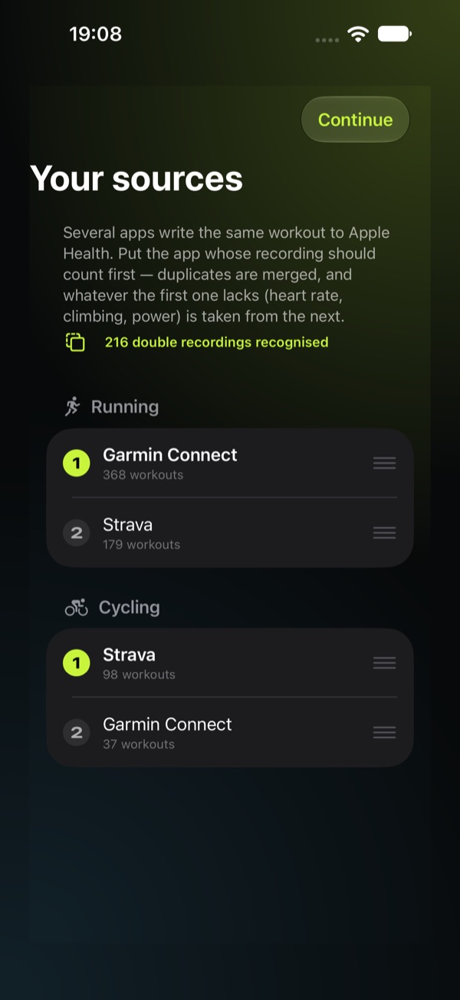

# 4Level — Stick to Your Resolutions

**One honest fitness level from your Apple Health workouts — and a clear view of whether you stick to your own training resolutions.**

4Level is made for ambitious amateur athletes who already train regularly and want to know: *How fit am I really — and am I sticking to what I set out to do?* It analyses the workouts you already record. It does not create training plans or coaching advice — you decide how you train; 4Level measures, explains and keeps you honest.

[**↓ Get it on the App Store**](https://apps.apple.com/app/4level/id6816633802) · [Website](https://4level.app.robspace.de)

---

## What it does

- **Your level, 1 to 100** — one number from fitness (training load, CTL), capacity (running VDOT or cycling W/kg) and consistency. Calculated for every day back to your first workout, using only what was known on that day. The formula is explained in the app.
- **Stick to your resolutions** — set per sport how often you intend to train, optionally with weekly, monthly or yearly kilometre targets. Plan adherence, 26-week heatmap, streak and month balance. The week counts by number of sessions, not by weekday.
- **Load, fatigue and freshness** — CTL, ATL and TSB, plus race predictions from 5 km to marathon.
- **Running, cycling and hiking** — yearly goals, year-over-year comparison, weekly volume, records.
- **Works with the apps you use** — reads from Apple Health (Apple Watch, Garmin Connect, Strava, Zwift, Wahoo …). You choose per sport which recording counts; double recordings count once.
- **Private by design** — no account, no server, no analytics, no ads. Data stays on your iPhone.
- **Demo mode** — explore the full app with sample data, no Health access needed.

## Screenshots

<table>
<tr>
<td></td>
<td></td>
<td></td>
</tr>
<tr>
<td></td>
<td></td>
<td></td>
</tr>
<tr>
<td></td>
<td></td>
<td></td>
</tr>
</table>

## Specs

| | |
|---|---|
| **Platform** | iPhone, iPad |
| **Minimum iOS** | 26.1 |
| **Category** | Health & Fitness |
| **Price** | 30 days free, then 4Level Pro: yearly subscription or one-time lifetime licence (in-app purchase) |
| **Languages** | English, German, French, Spanish, Italian (from version 1.1) |
| **Privacy** | Reads Apple Health (read-only), on-device only, no accounts, no tracking |

The level is a training aid, not a medical assessment.

## File an issue for 4Level

- 🐞 [Bug report — 4Level](https://github.com/RobEarth0815/robspace-apps/issues/new?labels=app%3A4level%2Ctype%3Abug%2Cstatus%3Aneeds-triage&template=bug_report.yml)
- ✨ [Feature request — 4Level](https://github.com/RobEarth0815/robspace-apps/issues/new?labels=app%3A4level%2Ctype%3Aenhancement%2Cstatus%3Aneeds-triage&template=feature_request.yml)
- 💬 [Discuss 4Level](https://github.com/RobEarth0815/robspace-apps/discussions)
- 🔍 [Browse open 4Level issues](https://github.com/RobEarth0815/robspace-apps/issues?q=is%3Aopen+is%3Aissue+label%3Aapp%3A4level)
