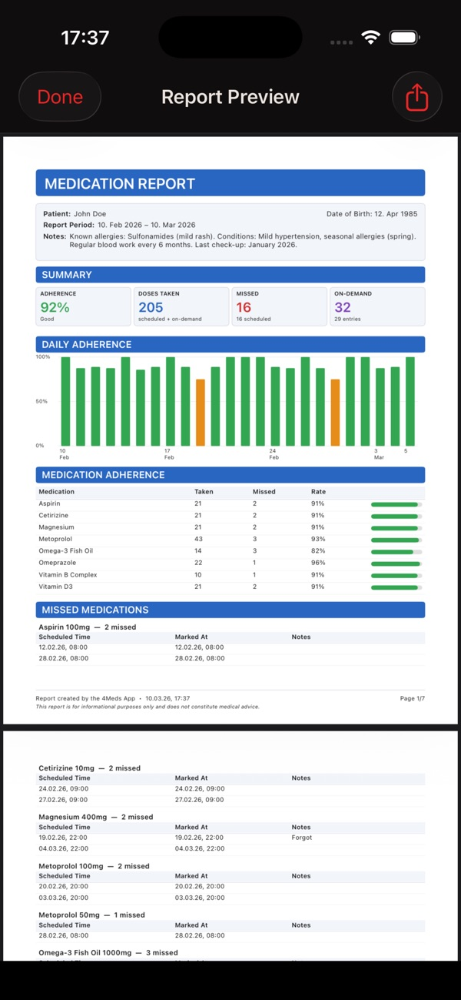
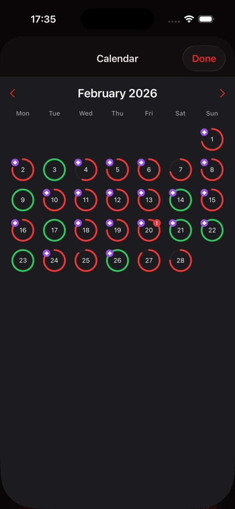
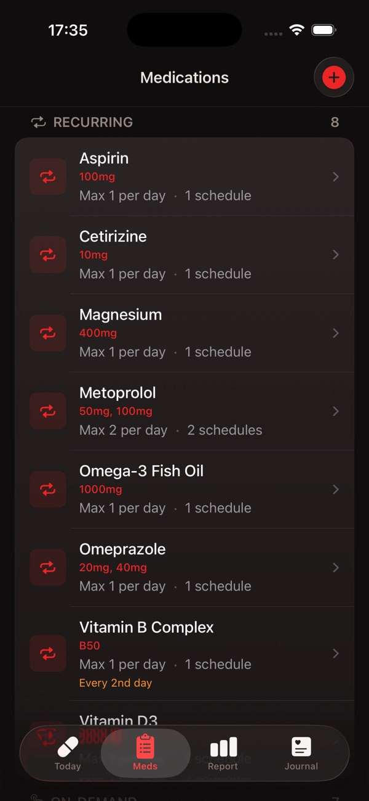
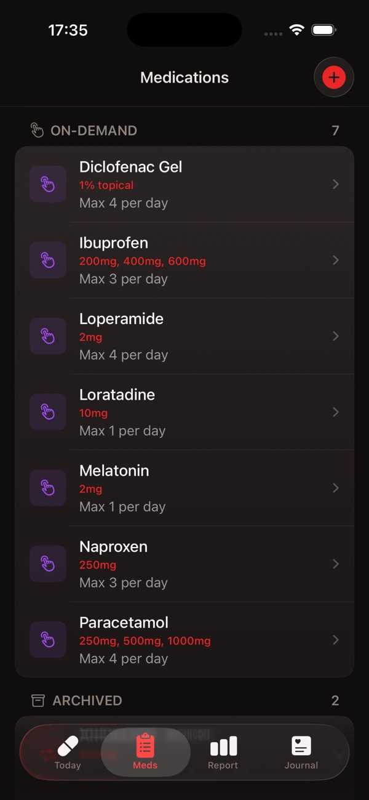
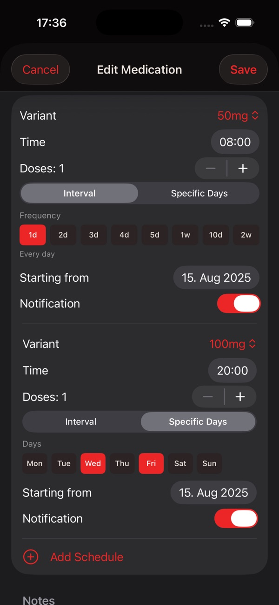
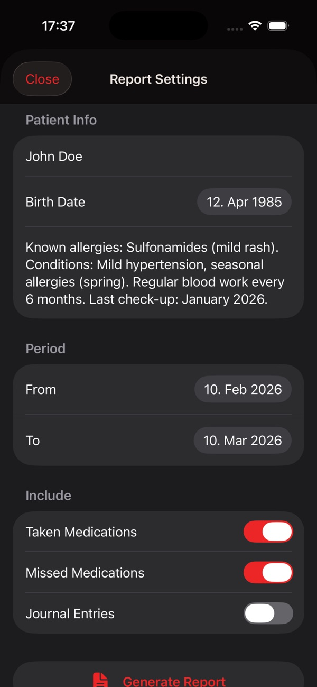
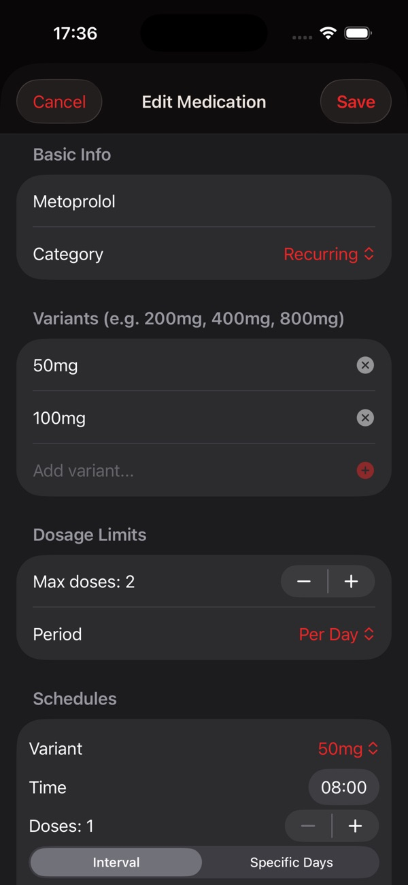
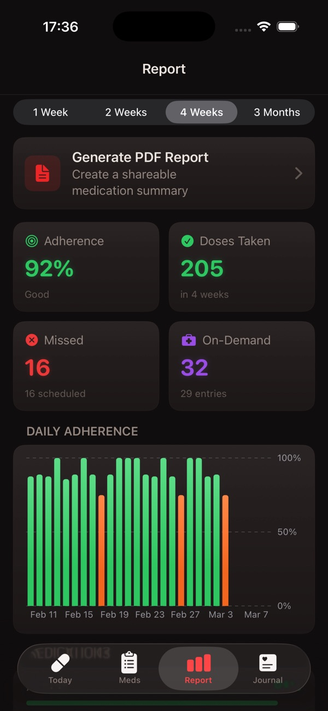

# 4Meds — Simple Medication Tracker

**Track medications, supplements, and the occasional painkiller. Offline, private, simple.**

4Meds is a medication tracker that doesn't try to be a health platform. No cloud sync, no accounts, no insurance integrations — just a clean way to know what to take, when, and when you last did.

[**↓ Get it on the App Store**](https://apps.apple.com/app/4meds/id6760107781) · [Website](https://4meds.app.robspace.de)

---

## What it does

- **Recurring and on-demand medications** — daily prescriptions, weekly supplements or the occasional painkiller, with dosage limits for on-demand meds.
- **Reminders** so you don't forget the morning dose.
- **Supply tracking & reorder reminders** *(from version 2.7)* — optional pack size per medication, counted down with every dose you log; a reminder before a supply runs out, plus a supply calendar and overview.
- **History view** — clear picture of what you've taken and when.
- **Local storage only.** No cloud, no sync, no leak.
- **iPhone.** SwiftUI, native, fast.

## Screenshots

<table>
<tr>
<td></td>
<td></td>
<td></td>
</tr>
<tr>
<td></td>
<td></td>
<td></td>
</tr>
<tr>
<td></td>
<td></td>
<td></td>
</tr>
</table>

Full gallery and latest screenshots on the [App Store page](https://apps.apple.com/app/4meds/id6760107781).

## Specs

| | |
|---|---|
| **Platform** | iPhone |
| **Minimum iOS** | 18.6 |
| **Category** | Health & Fitness |
| **Price** | $1.99 (one-time) |
| **Languages** | English |
| **Privacy** | No tracking, no accounts, no cloud sync |

## File an issue for 4Meds

- 🐞 [Bug report — 4Meds](https://github.com/RobEarth0815/robspace-apps/issues/new?labels=app%3A4meds%2Ctype%3Abug%2Cstatus%3Aneeds-triage&template=bug_report.yml)
- ✨ [Feature request — 4Meds](https://github.com/RobEarth0815/robspace-apps/issues/new?labels=app%3A4meds%2Ctype%3Aenhancement%2Cstatus%3Aneeds-triage&template=feature_request.yml)
- 💬 [Discuss 4Meds](https://github.com/RobEarth0815/robspace-apps/discussions)
- 🔍 [Browse open 4Meds issues](https://github.com/RobEarth0815/robspace-apps/issues?q=is%3Aopen+is%3Aissue+label%3Aapp%3A4meds)

> ⚠️ **Privacy reminder:** Don't paste real medication names tied to a real person in public issues. Use placeholders like "MedicationA, 5mg, twice daily" — the bug is reproducible without your actual prescription.
