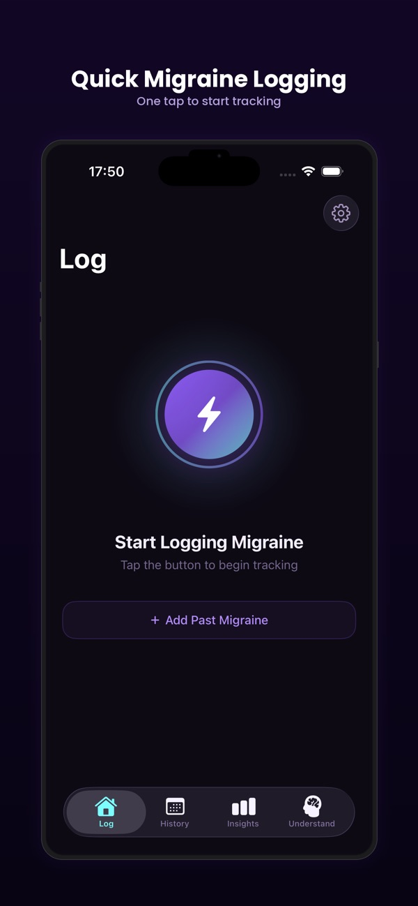
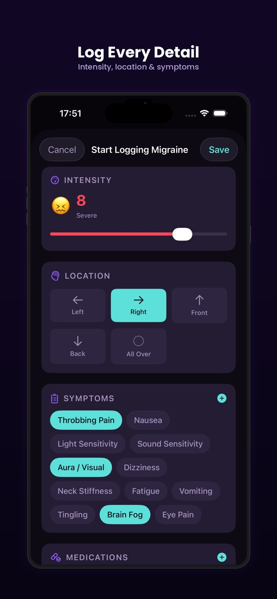
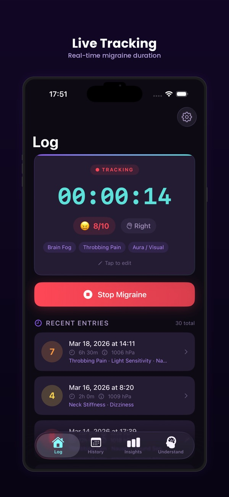
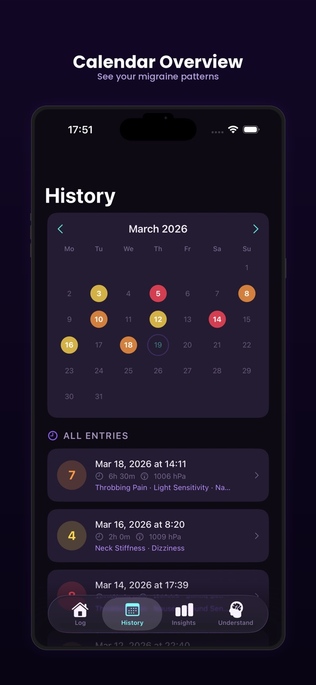
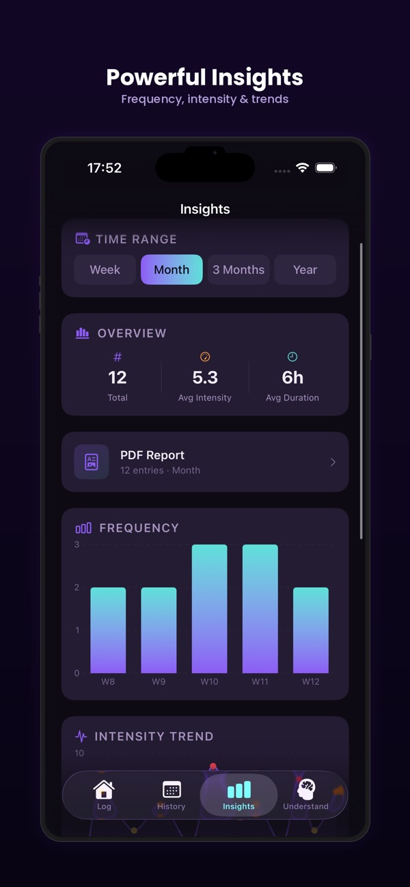
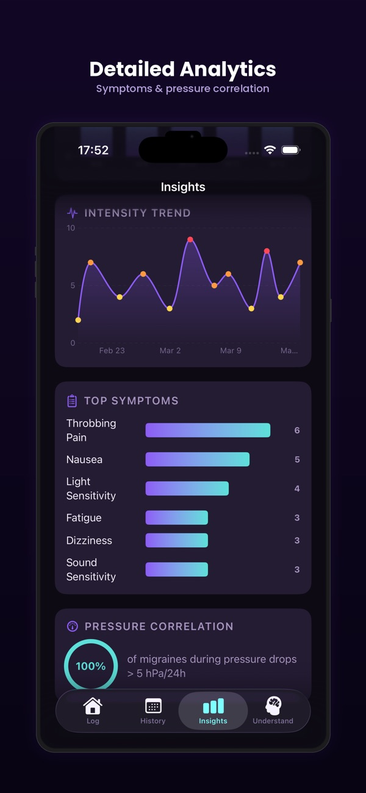
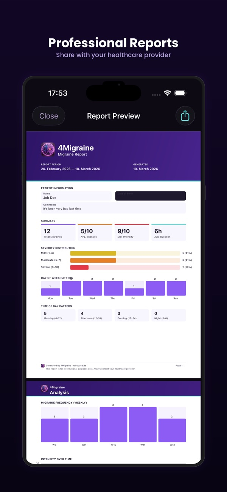
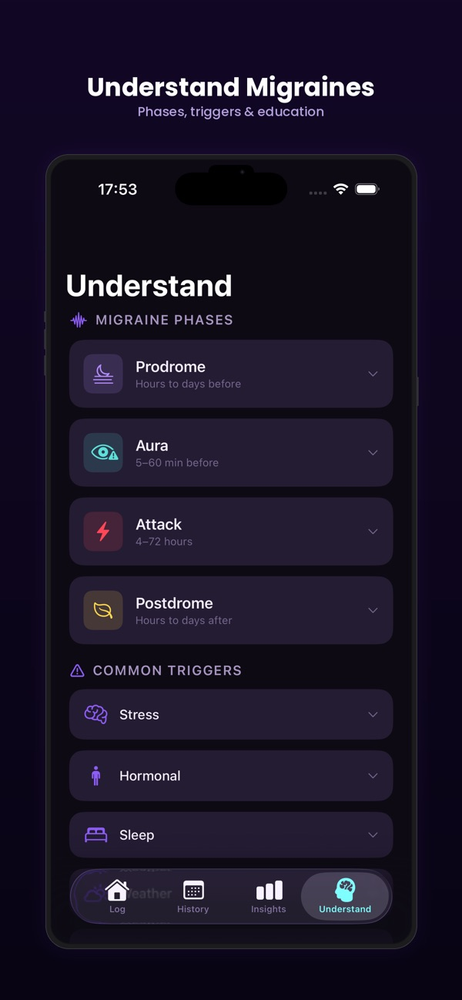

# 4Migraine — Smart Migraine Tracker

**Log attacks in real time, find patterns, hand your doctor a real report.**

4Migraine is for people whose head hurts often enough to need a tracker, and who'd rather have one that doesn't sell their health data. Real-time logging, weather context, pattern discovery, PDF reports — and everything stays on your phone.

[**↓ Get it on the App Store**](https://apps.apple.com/app/4migraine/id6760842125) · [Website](https://4migraine.app.robspace.de)

---

## What it does

- **Real-time attack logging** — duration, intensity, symptoms, triggers.
- **Weather data integration** — context for pattern hunting.
- **Pattern analytics** — what time of day, day of week, around which weather conditions.
- **PDF reports** for your doctor — sanitized, professional, ready to print.
- **Dark theme** — built for the moments when light hurts.
- **100% on-device.** No cloud, no account, no health-data resale.

## Screenshots

<table>
<tr>
<td></td>
<td></td>
<td></td>
</tr>
<tr>
<td></td>
<td></td>
<td></td>
</tr>
<tr>
<td></td>
<td></td>
<td></td>
</tr>
</table>

Full gallery and latest screenshots on the [App Store page](https://apps.apple.com/app/4migraine/id6760842125).

## Specs

| | |
|---|---|
| **Platform** | iPhone & iPad |
| **Minimum iOS** | 26.0 |
| **Category** | Health & Fitness |
| **Price** | $1.99 (one-time) |
| **Languages** | English |
| **Privacy** | All data on device, no cloud, no analytics |

## File an issue for 4Migraine

- 🐞 [Bug report — 4Migraine](https://github.com/RobEarth0815/robspace-apps/issues/new?labels=app%3A4migraine%2Ctype%3Abug%2Cstatus%3Aneeds-triage&template=bug_report.yml)
- ✨ [Feature request — 4Migraine](https://github.com/RobEarth0815/robspace-apps/issues/new?labels=app%3A4migraine%2Ctype%3Aenhancement%2Cstatus%3Aneeds-triage&template=feature_request.yml)
- 💬 [Discuss 4Migraine](https://github.com/RobEarth0815/robspace-apps/discussions)
- 🔍 [Browse open 4Migraine issues](https://github.com/RobEarth0815/robspace-apps/issues?q=is%3Aopen+is%3Aissue+label%3Aapp%3A4migraine)

> ⚠️ **Privacy reminder:** Migraine logs are health data. Don't paste your real attack history in public issues — describe the bug in general terms ("intensity slider doesn't save above 7") rather than with your actual entries.
