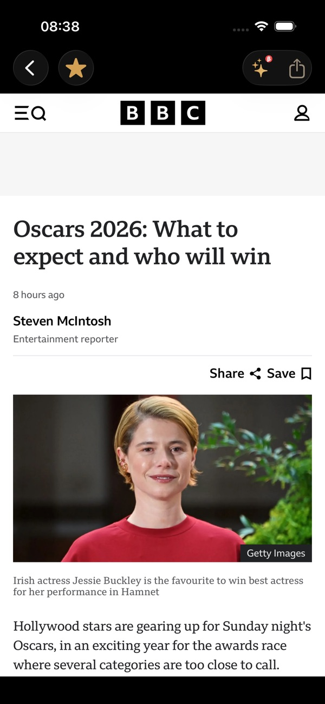

# 4RSS — Your Feeds, Your Way

**Minimalist RSS Reader for iPhone. No Tracking, No Accounts.**

4RSS is built around a single contrarian idea: you don't need 200 feeds, you need 4 good ones. The app limits you to four feed slots, requires no account, and includes optional AI-powered summaries — all without sending your reading habits anywhere.

[**↓ Get it on the App Store**](https://apps.apple.com/app/4rss/id6756433329) · [Website](https://4rss.app.robspace.de)

---

## What it does

- **4 feed slots.** You curate hard. The constraint *is* the feature.
- **AI summaries.** Optional, opt-in. Skim the day in seconds.
- **Offline reading.** Articles cached locally, readable on the U-Bahn.
- **No accounts, no tracking, no ads.** Your reading list is yours.
- **iPhone-native.** Built in SwiftUI for iOS 26.1+.

## Screenshots

  
  

More screenshots on the [App Store page](https://apps.apple.com/app/4rss/id6756433329).

## Specs

| | |
|---|---|
| **Platform** | iPhone |
| **Minimum iOS** | 26.1 |
| **Category** | News |
| **Price** | $0.99 (one-time) |
| **Languages** | English |
| **Privacy** | No tracking, no accounts |

## File an issue for 4RSS

- 🐞 [Bug report — 4RSS](https://github.com/RobEarth0815/robspace-apps/issues/new?labels=app%3A4rss%2Ctype%3Abug%2Cstatus%3Aneeds-triage&template=bug_report.yml)
- ✨ [Feature request — 4RSS](https://github.com/RobEarth0815/robspace-apps/issues/new?labels=app%3A4rss%2Ctype%3Aenhancement%2Cstatus%3Aneeds-triage&template=feature_request.yml)
- 💬 [Discuss 4RSS](https://github.com/RobEarth0815/robspace-apps/discussions)
- 🔍 [Browse open 4RSS issues](https://github.com/RobEarth0815/robspace-apps/issues?q=is%3Aopen+is%3Aissue+label%3Aapp%3A4rss)
