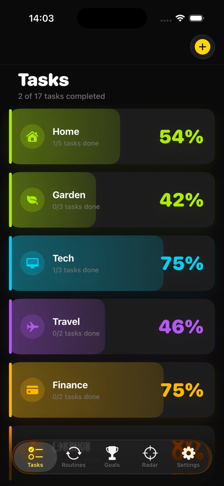
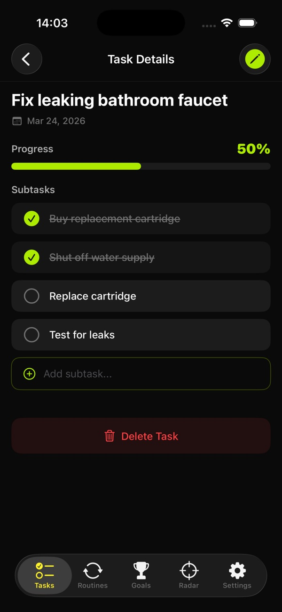
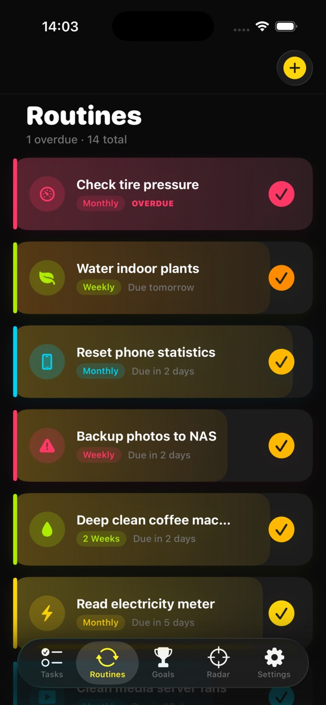
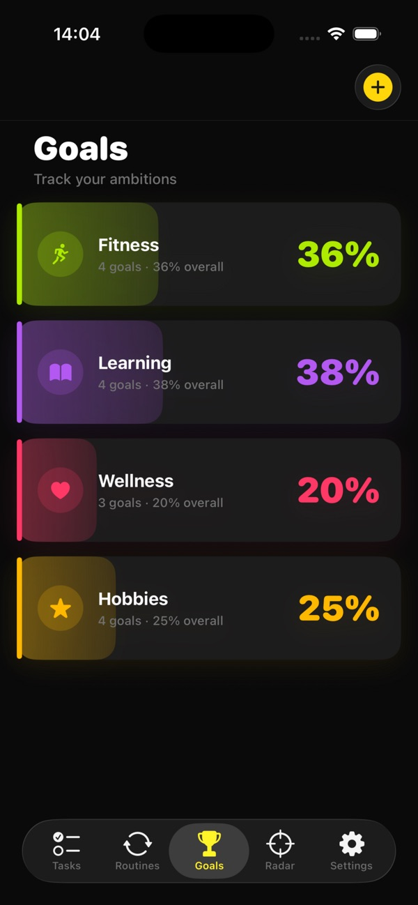
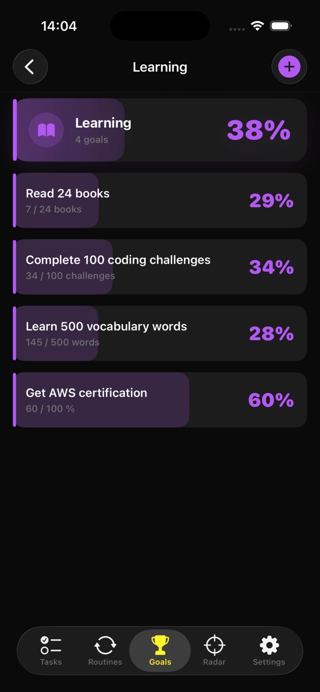
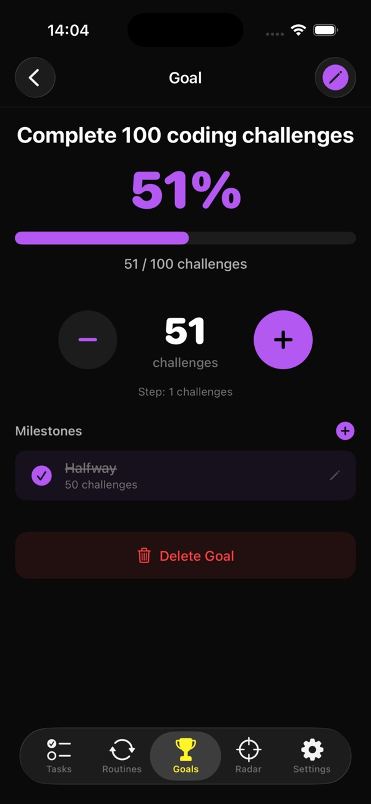

# 4ToDo — Simple Task Manager

**Tasks as progress bars, not checklists.**

4ToDo rethinks how you manage your day, your routines, and your goals. Instead of boring lists with checkboxes, every item is a visual progress bar — so you see at a glance exactly where you stand.

[**↓ Get it on the App Store**](https://apps.apple.com/app/4todo/id6760901710) · [Website](https://4todo.app.robspace.de)

---

## What it does

- **Visual progress bars** instead of static checkboxes — partial progress is a first-class concept.
- **Tasks, routines, goals** — three layers that cover one-off, repeating, and aspirational.
- **Clean, minimal interface** — no clutter, no widgets you didn't ask for.
- **Local-only.** No accounts, no sync, no cloud.
- **iPhone-native.** SwiftUI, fast, fluid.

## Screenshots

<table>
<tr>
<td></td>
<td></td>
<td></td>
</tr>
<tr>
<td></td>
<td></td>
<td></td>
</tr>
<tr>
<td></td>
<td></td>
<td></td>
</tr>
</table>

Full gallery and latest screenshots on the [App Store page](https://apps.apple.com/app/4todo/id6760901710).

## Specs

| | |
|---|---|
| **Platform** | iPhone |
| **Minimum iOS** | 26.0 |
| **Category** | Productivity |
| **Price** | $1.99 (one-time) |
| **Languages** | English |
| **Privacy** | Local-only, no accounts, no tracking |

## File an issue for 4ToDo

- 🐞 [Bug report — 4ToDo](https://github.com/RobEarth0815/robspace-apps/issues/new?labels=app%3A4todo%2Ctype%3Abug%2Cstatus%3Aneeds-triage&template=bug_report.yml)
- ✨ [Feature request — 4ToDo](https://github.com/RobEarth0815/robspace-apps/issues/new?labels=app%3A4todo%2Ctype%3Aenhancement%2Cstatus%3Aneeds-triage&template=feature_request.yml)
- 💬 [Discuss 4ToDo](https://github.com/RobEarth0815/robspace-apps/discussions)
- 🔍 [Browse open 4ToDo issues](https://github.com/RobEarth0815/robspace-apps/issues?q=is%3Aopen+is%3Aissue+label%3Aapp%3A4todo)
